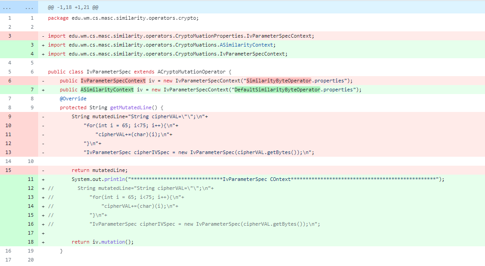

## MASC Web Interface
MASC web interafce is mainly based on django and java. The way it works is, we first collect  the jar file from MASC core with all the latest changes and updates that are need in order to properly integrate the web interface. Once the jar is ready it is stored in a particular location. The django app further utilizes this jar to carry out other tasks.

The django app is mainly divided into small modules. Some of the main modules are MASC Lab, MASC Engine, Tool Profiling, Plugins, Configuration Manager.

### DESIGN
The jar mainly acts as back end for the web interface, where as the django app plays the role of both the front end and the back end. When the user runs a specific task the django app utilizes the jar with appropriate commands and parameters and once the operation of the jar is finished it collects the results and stores them for further usage.

 #### Database
 We have used SQLite as the primary data source for the web interface. Datas like  configuration file related infos, plugin related infos, history of the privious ran processes etc are stored in the database. The main models are
 1. Process Log
 2. Property List (Configuration List)
 3. SOurce Code
 4. Plugins
 5. Tool Profile
 6. Reports

 #### Configuration Manager
 The user uploads a configuration file. It is stored in a particular location at the server. The path and file related informations are saved in the database. The user cann visualize and also update the contents of this files. This data is also used by other modules such as MASC Lab, MASC Engine, Tool profile. COnfigurations are the key to run MASC. So MASc web has introduced this interface using which users will be able to easily run any mutations according to their needs.

 #### MASC Lab
 MASC Lab can be labled as the playground for beginners exploring MASC> Users can test their configurations and see the mutations. MASC Lab only utilizes the MAIN Scope of MASC. The way it works is, users select a configuration , they get the option to update the configurations once they are happy with it MASC core is ran that is the jar is ran with specific parameters given in the configuration. The results are generated. The django app parses this results and displays them to the users. The user can also download the mutated codes. In that case the web interafce compresses this codes and makes them available to the users. This part uses the previously discussed configurations managers datas to indicate the user selected configuration.


#### MASC Engine
MASC Engine is the key feature of MASC web. It takes a source code and mutates it  using the SELECTIVE or EXHAUSTIVE scope. It takes zipped source code from the user and extracts it in a particular location. Then with the configuration provided by the user it runs the mutation operation. Here some operations may take time, so the web interface uses django thrfead and subprocesses to run the jar hence the main application is never blocked. Once the process is finished, the thread updates the data in the database and merges with the main thread. The user can easily check the status of this proccesses. Once the process is completed user can download the mutated code as zip file.

#### Plugin Manager
Plugins can be integrated in MASC. When the user runs any mutation they are automatiocally included in the mutation process. Before that user needs to build a plugin using MASC. First the user has a java code and once they build that code with MASC Core theyy get a class file which is used in further processing. In MASC web the user upload the java file. There is an option to build the java file. When the user hits build the code is compiled using the jar and the .class file is generated. Now, the user may not always want to include the plugin in the mutation process. So they have the ability to customize this. The plugins have a prop[erty named status. When the status of a plugin is ```actived``` it will take part in a mutation. User can inactivate it. When the user inactivates a plugin it is moved to a different location and no longer available for mutation. Once the user again wants it to take part in the mutation process they can just change the status and it will be again moved back to the plugins folder where it will be available for mutation.

#### Tool Profile
The user has to provide tool configuration in the configurations file. This runs the mutation and then runs the crypto detector to generate the test result. The jar is ran with the configuration and generated result is then saved for further usage. This process is also ran in seperate thread. ANd once the process ends the status of the process is updated.

### Update to MASC Core
- Updated  the log mechanism of MASC Core. Added ```log42j``` and replaced System.outputs.
- Added the option to exclude any operators from the mutation process of MAIN Scope. Users can only run the mutations which they want. Updated the getOPerators method in order exclude the operators which user have mentioned.
```
    public HashMap<OperatorType, IOperator> getOperators(String excludedOperators){
        if(excludedOperators.isEmpty()){
            logger.trace("No excluded out operators");
            return operators;
        }
        HashMap<OperatorType, IOperator> tempOperators =  new HashMap<>();
        for (HashMap.Entry<OperatorType, IOperator> entry : operators.entrySet()) {
            if(!excludedOperators.contains(entry.getKey().name())){
                logger.trace("Selected opertor "+entry.getKey().name());
                tempOperators.put(entry.getKey(),entry.getValue());
            }
        }
        return tempOperators;
    }
```

- Updated SIMILARITY Scope mutations with MAIN Scope mutations. That is replaced SSLContext and IvParameterContext mutations with MAIN scope mutations. The following is an example where the hard coded byte operator mutation was replaced with mutation from MAIN Scope.



